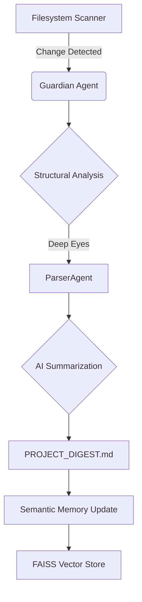

# 🛡️ Autonomous System Guardian
> **⚠️ Variant Notice**: This repository is a specialized security-focused branch of the [AI-CodeCompass](https://github.com/w8explorer/AI-CodeCompass) framework, optimized for autonomous system monitoring on Ubuntu.

> **Powered by AI-CodeCompass Intelligence Suite**

[](https://github.com/w8explorer/AI-CodeCompass)
[](https://github.com/w8explorer/AI-CodeCompass)
[](https://github.com/w8explorer/AI-CodeCompass)

## 📋 Overview

The **Autonomous System Guardian** is a high-intelligence monitoring and security suite designed to protect and document local Linux environments. It transforms raw filesystem activity into structured, actionable intelligence using advanced AST parsing and semantic vector memory.

Unlike traditional monitoring tools, the Guardian understands **what** changed in your code (at the function and class level) and **why** it matters, maintaining a persistent "Giant Brain" of your project's history.

---

## 🚀 Advanced Features

### 👁️ Structural Intelligence ("Deep Eyes")
Powered by the `ParserAgent`, the Guardian performs deep AST (Abstract Syntax Tree) analysis on every modified file.
- **Logic Awareness**: Detects specific changes in functions, classes, and logic blocks.
- **Complexity Analysis**: Identifies potential technical debt or security risks introduced by code changes.

### 🧠 Semantic Memory ("Giant Brain")
Integrated with a **FAISS Vector Store**, the Guardian never forgets.
- **Persistent Context**: Indexes every security report into a searchable vector database.
- **RAG-Ready**: Future-proof architecture allowed for Retrieval-Augmented Generation over historical system events.

### 🛡️ Autonomous Security Auditing
The Guardian is designed to run silently and autonomously in the background.
- **15-Minute Sweeps**: Periodic filesystem scans triggered by the native `scanner.sh` scout.
- **Human-in-the-Loop**: Optional interactive mode allows developers to provide context "notes" during critical changes.

---

## 🛠️ Architecture

The Guardian is orchestrated using **LangGraph**, ensuring a reliable and deterministic flow between sensing, thinking, and reporting.



---

## 📦 Getting Started

### 1. Requirements
- **OS**: Ubuntu / Debian (ARM64 Optimized)
- **AI Backend**: `llama.cpp` or OpenAI-compatible server (default: port 1234)
- **Environment**: Python 3.12+ (Virtual Environment Recommended)

### 2. Manual Activation
Run a high-intelligence scan manually to see the Guardian in action:
```bash
/home/ubuntu/llm_pipeline_env/bin/python3 guardian.py
```

### 3. Background Automation
The Guardian is typically scheduled via Crontab:
```bash
*/15 * * * * /bin/bash /home/ubuntu/AI-CodeCompass/scripts/scanner.sh
```

---

## 🧠 Technology Stack

- **Orchestration**: LangGraph, LangChain
- **Vector Store**: FAISS (Facebook AI Similarity Search)
- **Code Parsing**: Tree-sitter, AST-Python
- **LLM Support**: Llama 3.2 1B Instruct (via llama.cpp)
- **Persistence**: SQLite (Session History), FAISS (Semantic Memory)

---

## 🔐 Security & Privacy
The Guardian is built for **local execution**. All code analysis and memory indexing happen on your server, ensuring that your logic and system state never leave your infrastructure.

---
*Maintained by the AI-CodeCompass Team & Upgraded to Guardian Status.*
